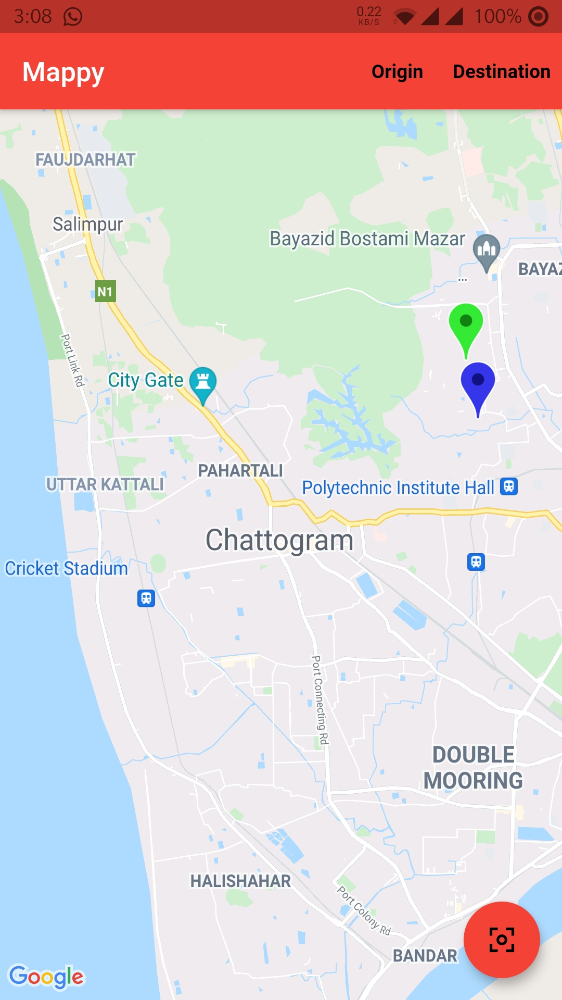
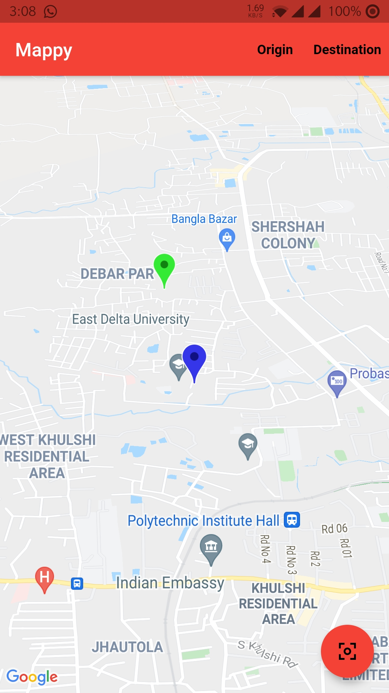

# Mappy - Working With Google Maps in Flutter

### Description
 A Project in Flutter with google maps to add markers on map, changing camera positions on map view, and get directions betweeen two points From Directions API.

 ### Screenshots

